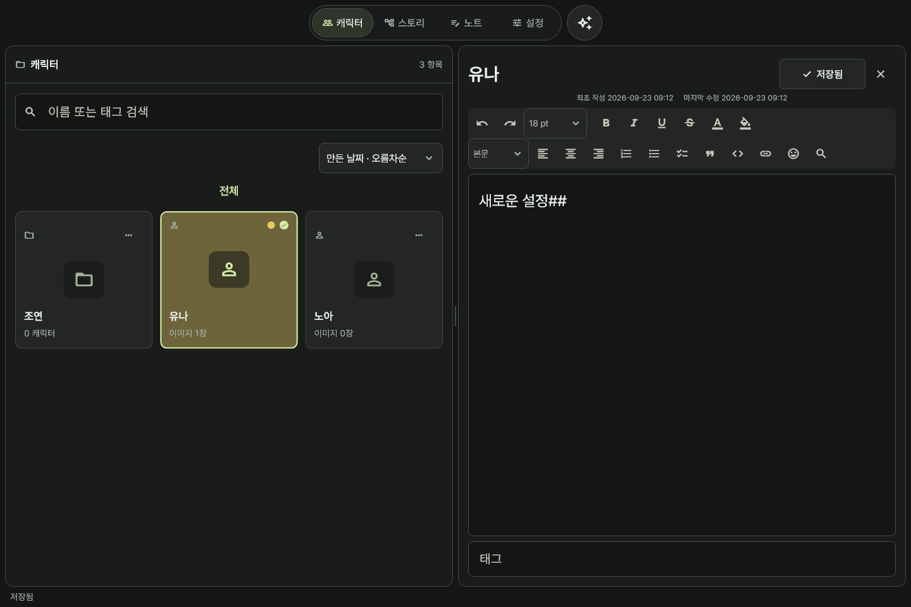

# Ateliai 0.8.3

Windows와 Android에서 캐릭터, 이미지, 스토리, 노트를 관리하는 개인 창작 작업 공간입니다. 기본 데이터는 기기에 저장합니다.



## 설치

0.8.3은 Windows x64 설치 파일로 제공합니다. GitHub 업로드는 보류 상태입니다. Windows 10 1809 이상이 필요합니다. Pretendard는 앱에 포함되며 시스템 폰트를 설치하지 않습니다. 기존 설치 위에 업데이트하면 앱 데이터는 유지됩니다.

[0.8.3 변경사항과 검증 범위](docs/RELEASE-0.8.3.md)

## 주요 기능

- 폴더 안에 폴더·캐릭터, 캐릭터 안에 폴더를 만드는 계층 구조. 기존 작품은 폴더로 자동 변환됩니다.
- 정사각형 카드와 좌우 분할, 즉시 선택, 더블클릭으로 폴더 열기. 빈 곳·항목 우클릭으로 생성·색상·삭제 메뉴를 엽니다. 모바일에서는 길게 누르거나 항목 메뉴를 사용합니다.
- 캐릭터 내부 이미지 가져오기·외부 파일 드롭·다중 태그. 이미지 더블클릭 확대, 우클릭 대표 이미지 지정. 이미지 선택 중에는 외부 파일 드롭을 막습니다.
- 15가지 분류 색상, 전체 선택 테두리, 최초 작성·마지막 수정 날짜.
- 캐릭터·스토리·노트 서식 편집기: 제목 1–6, 굵게·기울임·밑줄·취소선·글자 크기·글자색·배경색·목록·체크 목록·인용·코드·링크·정렬·실행 취소/다시 실행. 줄 앞의 `#` 개수에 따라 제목 색을 표시하며 # 문자 자체는 유지합니다. 사용 빈도에 따른 2줄 도구 모음과 좁은 화면의 더보기 메뉴를 제공합니다. 이모티콘 목록 제공.
- 마지막 입력 후 2초간 추가 입력이 없으면 자동저장, 항목 전환·앱 종료 시 저장. 변경된 텍스트는 30분마다 분류/날짜/시간 이름의 임시버전으로 별도 보관. 보관 기간 30일·7일·1일·무기한, 보기·복원·삭제.
- 설정에서 글별 이전 변경 사항 보관 개수 선택·목록 조회·복원. 노트 전용 폴더, 유저노트·프롬프트 종류.
- 스토리 전체와 개별 장면의 등장인물 연결.
- 기본 테마 + 추가 10종. 배경 이미지 업로드, 불투명도·블러, 주요 색상 추출과 배경 맞춤 테마.
- 오른쪽 AI 패널: 사용자가 설정한 OpenAI 호환 Chat Completions API, 선택한 캐릭터·스토리·노트 참조, 선택적 대표 이미지 전송, Enter 전송·답변 스트리밍, 이미지 파일 첨부/드롭(최대 4장, 장당 5MB). 이미지 입력 지원 모델이 필요합니다. 전송 직전 작성 중인 내용을 저장합니다.
- AI 모드: 일반 대화 / NovelAI용 캐릭터 완성 프롬프트. 모드별 기록 분리, 결과 구역 복사와 프롬프트 노트 저장. [지침 구성](docs/AI-MODES.md).
- Notion: 연결에 공유된 페이지 검색 → 선택 페이지와 하위 블록 읽기 → 캐릭터/스토리/노트 자동 추정 → 사용자 검토·분류 수정 → 일괄 가져오기.
- Google Drive 앱 전용 영역을 이용한 선택적 PC/Android 동기화 어댑터. 동시 수정은 양쪽 버전을 보관하고 설정에서 선택합니다.

## 연결과 데이터

[Google Drive·Notion·AI 설정 및 제한](docs/CONNECTIONS.md)을 확인하세요. 각 연결은 별도 계정 권한과 설정이 필요합니다. 연결하지 않아도 로컬 기능은 사용할 수 있습니다.

API 키·Notion 토큰·Google 갱신 토큰은 기기의 보안 저장소에 보관하고 동기화하지 않습니다. 작업 데이터와 이미지 자체는 암호화되지 않은 로컬 파일입니다. 임시버전 삭제는 별도 임시복사본에 적용하며, 영구 수정 이력까지 삭제하는 기능은 아닙니다.

설정 하단에 실제 데이터 경로가 표시됩니다. 앱 종료 후 해당 폴더 전체를 복사하면 백업할 수 있습니다. `--data-dir=절대경로` 인수로 별도 작업 공간을 열 수 있습니다.

## 개발

검증 환경: Flutter 3.47.4 / Dart 3.13.3. Windows 빌드에는 Visual Studio C++ 데스크톱 도구, 설치파일에는 Inno Setup이 필요합니다.

```powershell
flutter pub get
flutter analyze
flutter test
flutter build windows --release
.\installer\build-windows.ps1 -Flutter flutter -Iscc 'C:\Program Files (x86)\Inno Setup 7\ISCC.exe'
```

Android 개발 빌드:

```sh
flutter build apk --debug
```

Android 배포 서명키는 포함하지 않습니다. 현재 Gradle release 설정도 개발용 서명을 사용하므로 Play 배포 전 별도의 키와 OAuth 인증서 등록이 필요합니다. GitHub Actions는 테스트와 Android 개발 APK 빌드를 실행합니다.

## 검증 범위

[검증 기록](docs/VALIDATION.md). Notion과 동일한 데이터베이스·협업·표·토글 블록 편집기 전체를 구현한 것은 아닙니다. Notion 가져오기는 텍스트 중심이며, 파일/이미지는 원본 참조 안내를 남깁니다. 실제 Google/Notion 계정 연결 및 Android 실기기 왕복 동기화는 별도 확인이 필요합니다.

Pretendard: [SIL Open Font License](assets/fonts/OFL.txt). 앱 소스에 대한 별도 오픈소스 라이선스는 아직 지정하지 않았습니다.
